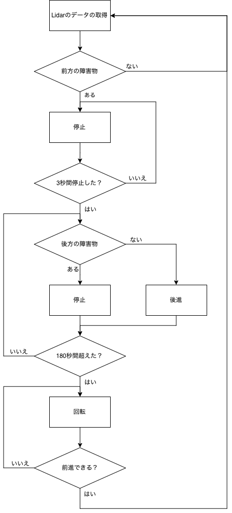

# avoid_clashing

## 必要なリポシトリー
1. [orne_navigationのfix_scan__#337ブランチ](https://github.com/open-rdc/orne_navigation/tree/fix_scan__%23337)
2. [ira_laser_tools](https://github.com/iralabdisco/ira_laser_tools)

## ira_laser_toolsについて

[master](https://github.com/iralabdisco/ira_laser_tools/tree/master)と[kinetic](https://github.com/iralabdisco/ira_laser_tools/tree/kinetic)のブランチがあります。

**※ kineticブランチを推薦します。**

* kinectブランチ：

    そのままでビルドできます。

* masterブランチ：

  ira_laser_toolsをビルドする前に、以下のコマンドを実行してください。
  ```
  $ sed -i -e 's:>pcl<:>perception_pcl<:g' ~/catkin_ws/src/ira_laser_tools/package.xml
  $ sed -i -e 's:<pcl/ros/conversions.h>:<pcl/conversions.h>:g' ~/catkin_ws/src/ira_laser_tools/src/laserscan_multi_merger.cpp
  ```
  
## 実行の手順
1. orne_bringupでorne_betaを起動する。[orne_navigationから参考](https://github.com/open-rdc/orne_navigation/wiki/ORNE%E7%92%B0%E5%A2%83%E5%8B%95%E4%BD%9C%E3%81%AE%E6%89%8B%E9%A0%86)

    * 実機を利用する場合：
    ```
    $ roslaunch orne_bringup orne_beta_2urg.launch
    ```
    * シミュレーターを利用する場合：
    ```
    $ roslaunch orne_bringup orne_beta_sim_2urg.launch
    ```

2. ira_laser_toolsで前と後ろのLidarを合成する。
    ```
    $ roslaunch orne_bringup laserscan_multi_merger.launch
    ```
3. 障害物を回避するノードを起動する。
    ```
    rosrun avoid_clashing avoid_clashing_node
    ```

## ノード内の処理
前方の障害物がなくなったら、このプログラムが自動的にリセットします。


